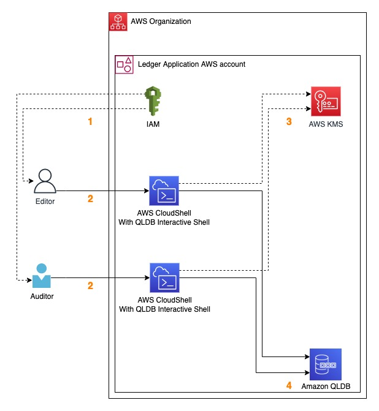
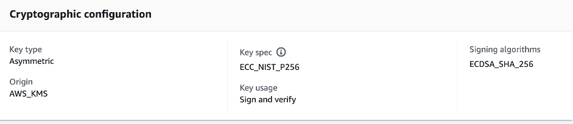

# aws-blog-improve-data-auditatibility-with-amazon-qldb-and-aws-kms

Sample code and artefacts for AWS Blog submission titled "Improve auditability of your data with Amazon QLDB and digital signatures supported by AWS KMS"

## Summary

In this repo, we show an approach to set up a data signing and verification flow within a single AWS account for a sample loyalty points token bridge application using Amazon QLDB and digital signatures supported by AWS KMS. We create an Asymmetric Key created in AWS KMS and using KMS-provided APIs to sign and verify signatures we describe typical workflows for two types of users – one being a regular user who performs create, read, update, delete operations, and the other who audits the records and verifies signatures. We also mention an offline workflow for signature verification when the auditor does not have access to the KMS Key and KMS APIs.

## Prerequisites and limitations

To complete the steps for the single-account setup described in this post, you will need the following:
- An AWS account with permissions to operate in the us-east-1 AWS region
- Administrator user with access to AWS console and full access to AWS CloudFormation, AWS IAM, AWS CloudShell, Amazon QLDB and AWS KMS
- AWS CloudShell with Amazon QLDB Interactive Shell

## Target architecture



The above figure shows the resources created within a single account. 

In our scenario we will consider three users of Amazon QLDB:
1. An Administrator user with access to the AWS console to create the ledger, populate it with sample data and configure access to the other two users. In a single-account setup, this user can also act as the AWS KMS key administrator.
2. An Editor user who creates, reads, updates, deletes and signs the records in the QLDB ledger.
3. An Auditor who reads data from the QLDB ledger and verifies the digital signatures.
As per security best practices in IAM (link), both the editor and auditor users assume roles with restricted permissions to perform their activities. In a multi-account setup using AWS SSO as the identity store, the roles can be converted into permission sets and attached to the respective users.

Each user uses credentials generated for their respective role to gain access to the AWS account hosting the QLDB ledger. The Editor user creates table entries in the ledger and signs the message with an asymmetric AWS KMS key. Along with the message, the Editor user also inserts the signature, the KMS key ARN used to sign the message, the public key and the signing algorithm into the table record. The Auditor reads table entries from the ledger and verifies the digital signature using the public key in the same entry. AWS CloudShell is used to perform both the Editor and Auditor workflows.

## User Workflows

The actions performed by the users are explained at a high level in this section.

### Admin user
- Login to the AWS account in the us-east-1 region and launch AWS CloudShell
- Create a QLDB ledger
- Create a symmetric key in AWS KMS to encrypt the QLDB ledger data at-rest, and assign key policy
- Create an asymmetric key pair in AWS KMS for signing messages, and assign key policy
- Create Editor and Auditor IAM roles and assign permissions policies
- Install OpenSSL (Optional)
- Install QLDB Interactive Shell
- Create table in the QLDB ledger

### Editor user
- Assume the Editor role within CloudShell
- Prepare data for signing
- Sign data with the KMS managed asymmetric key
- Connect to the QLDB ledger created by the admin user
- Insert data with signature, public key, KMS key ARN and signing algorithm details to the table

### Auditor user
- Assume the Auditor role within CloudShell
- Connect to the QLDB ledger created by the admin user
- Get the record from the table within the ledger, whose data signature needs to be verified
- Verify signature using either KMS or OpenSSL

## Detailed description
This section explains the steps to implement the solution in detail.

### Initial setup
The steps under this section are performed by an Admin user who is responsible for the initial setup of tools and deployment of necessary components in AWS IAM, AWS KMS and Amazon QLDB. The Admin user sets up the required components using CLI commands performed through the AWS CloudShell in the us-east-1 region.

#### Step 1 - Create QLDB Ledger
The first step is for the Admin user to create a QLDB ledger and table and populate it with sample data. It is recommended to turn on encryption for data at-rest in the ledger using a KMS-managed key using the instructions [here](https://docs.aws.amazon.com/qldb/latest/developerguide/encryption-at-rest.using-cust-keys.html#encryption-at-rest.using-cust-keys.specify). 

#### Step 2 - Create signing key pair
Next, create the asymmetric key pair(s) on AWS KMS and a key policy providing necessary access permissions to the IAM roles assumed by the Editor and Auditor respectively. The cryptographic configuration for the key created in the sample implementation is shown in the figure below.



The key policy should allow the Editor’s role to sign messages before writing them to the ledger. The key policy can also allow for the Auditor’s role to verify messages.

#### Step 3 - Create IAM Roles
Next create IAM roles one for each type of user – Editor and Auditor – with specific permissions defining their access restrictions to the QLDB ledger and table. For the QLDB ledger, the Editor is typically allowed all permissions on the data plane for create, read, update or delete operations on the ledger’s tables. With regards to KMS permissions, the Editor user should be allowed to sign with the private key and also export the public key. The Auditor should be allowed read permissions to the QLDB ledger tables as well as to verify the signed message using the public key.

The QLDB ledger, KMS data encryption key, KMS signing key pair and IAM roles (components in steps 1 up to 3) can be created by the Admin user by deploying the CloudFormation template provided in the attached repository.

#### Step 4 - Install OpenSSL (optional)
OpenSSL software is a robust, commercial-grade, full-featured toolkit for general-purpose cryptography and secure communication. In this project, OpenSSL is used by the Auditor as one possible method to verify the signatures for the data records. Install this tool using the instructions provided in the Installer.sh script included in the attached repository.

#### Step 5 - Install & Configure the QLDB Interactive Shell
Amazon QLDB provides a command line shell for interaction with the transactional data API. With the QLDB shell, you can run PartiQL statements on ledger data. Install and configure this shell to continue with the rest of the setup process. The steps to do this are provided under the Installer.sh script included in the attached repository.

#### Step 6 - Create the QLDB Ledger table
In the case of the sample application described in this project, the QLDB ledger contains tables recording the point transactions between the relevant stakeholder accounts. The steps to create the QLDB ledger table are provided under the Installer.sh script included in the attached repository. The order of running these steps is to be retained as explained above. With the required resources provisioned, the Editor and Auditor users are now ready to proceed with their regular transactions on the QLDB ledger.

### Si​gning the data
The steps under this section are performed by an Editor user who is responsible for preparing, signing and inserting records into the table within the QLDB ledger.

Launch AWS CloudShell and proceed to assume the IAM role of the Editor user. Prepare the data to be signed; this is denoted by the attribute 'data' shown in the format below. Sample values are also provided for the attributes. Next sign the data and compose the record in the format shown below:
```bash
{
  'data': 'Transfer from AcmeCorpToken.ABC to DoeBankToken.DEF and equivalent of 10 AcmeToken as 20 DoeBankToken',
  'signature': {
      'kmsKeyARN': '<ARN of the KMS signing key>',
      'publicKey': '<Public part of the KMS signing key>',
      'signature': '<the signed message>',
      'signingAlgorithm':'ECDSA_SHA_256'
   }
}
```
The above record object contains the following fields:
- 'data' that contains the value that represents the message to be signed.
- 'signature' field includes
  - 'kmsKeyARN' which is the ARN of the AWS KMS key used for signing,
  - 'publicKey' which is the the public part of the KMS signing key,
  - 'signature' which is the the signed message
  - 'signingAlgorithm' which describes the signing algorithm used to create the signature

Insert the record into the 'SharedData' table within the QLDB ledger created in Step 6 above. To perform these actions, run the Editor.sh script included in the attached repository.

### Verifying the signature
There are two ways for the Auditor to verify the signed message:

The Auditor’s role is given access permissions to verify signatures with the KMS key, in which case the key policy should allow the role for the auditor to verify signatures using KMS API calls.
The Auditor is provided an exported public key from the KMS key. This public key is inserted along with the message as a table entry column in the ledger table. The Auditor uses the public key and verifies the signature offline using external libraries like OpenSSL. Refer to this link on the steps to achieve the same.
The steps to verify signatures using both methods are explained below.

Launch AWS CloudShell and proceed to assume the IAM role of the Auditor user. Gather the required information to verify the signature using either method. When using KMS API calls to verify the signature, extract the signing key ARN and signing algorithm details and then proceed to verify by placing a call to KMS Verify API endpoint. When using Open SSL, extract the public part of the KMS key, encode the items in appropriate formats and proceed to verify by placing a call to openssl dgst method. To perform these actions, run the Auditor.sh script included in the attached repository.

This concludes the entire process from setup to verification.

## Cleanup

To cleanup the artefacts setup in this pattern, run the steps below:
1. Drop the Table created within the Ledger, by running the following command:
```bash
cd ~/qldb-v2.0.1-linux
./qldb
DROP TABLE SharedData
# press `CTRL-D` to exit QLDB Interactive Shell
```


2. Delete the CloudFormation stack, by running the following command:
```bash
aws cloudformation delete-stack --stack-name QLDB-KMS-TEST --region us-east-1
```

## Security

See [CONTRIBUTING](CONTRIBUTING.md#security-issue-notifications) for more information.

## License

This library is licensed under the MIT-0 License. See the LICENSE file.

